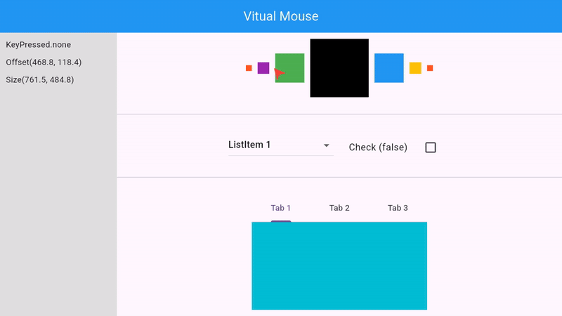

# Virtual Mouse


This package was created to solve a common problem in applications developed for TV and WebView. Interacting directly with the rendered components.

## Platforms

- [x] Android
- [x] IOs

[Note] The library tries to simulate the behavior of a click on the screen based on the cursor positions and coordinates. Restricting its use only to devices with gestures and touches on the screen.



## Register your virtual mouse

```dart
  VirtualMouse(
    onKeyPressed: (key) {
      // KeyPressed current state (pressed/unpressed)
    },
    onMove: (offset, size) {
      // Cursor position and Size screen dimension.
    },
    child: Column(
      children: [
        /// Add the components for Interactions
      ],
    ),
  ),
```

Note that a String `cacheName` will be returned by the function `registerCursor`, which can be used to set this cursor to system or delete this cursor.

## Set on custom cursor

The Mouse is waiting to receive a componente extends on `CustomPainter`. Default is Painter basic with red arrow.

```dart
  VirtualMouse(
    pointer: MyCustomPointer()
    //....
  )
```

```dart
class MyCustomPointer extends CustomPainter {}

```

## VirtualMouse Propreties

| Property       | Description                                                                                                |
| -------------- | ---------------------------------------------------------------------------------------------------------- |
| `child`        | (Required) The child widget to be rendered inside the virtual mouse cursor.                                |
| `node`         | (Optional) The focus node to be used in the virtual mouse cursor                                           |
| `autoFocus`    | (Optional) If the virtual mouse cursor should be focused when the widget is rendered. The default is true. |
| `velocity`     | (Optional) The velocity of the virtual mouse cursor movement incremented. The default is 1.0               |
| `duration`     | (Optional) The duration of the virtual mouse cursor movement in milliseconds. The default is 10.           |
| `angle`        | (Optional) The angle of the pointer in degrees. The default is -40.0.                                      |
| `pointerColor` | (Optional) The color of the pointer. The default is Colors.red.                                            |
| `pointer`      | (Optional) Custom pointer to be used in the virtual mouse cursor.                                          |
| `onKeyPressed` | (Function) Callback to be called when a key is pressed. The key pressed is passed as argument.             |
| `onMove`       | (Function) Callback to be called when the mouse is moved to a new position.                                |
